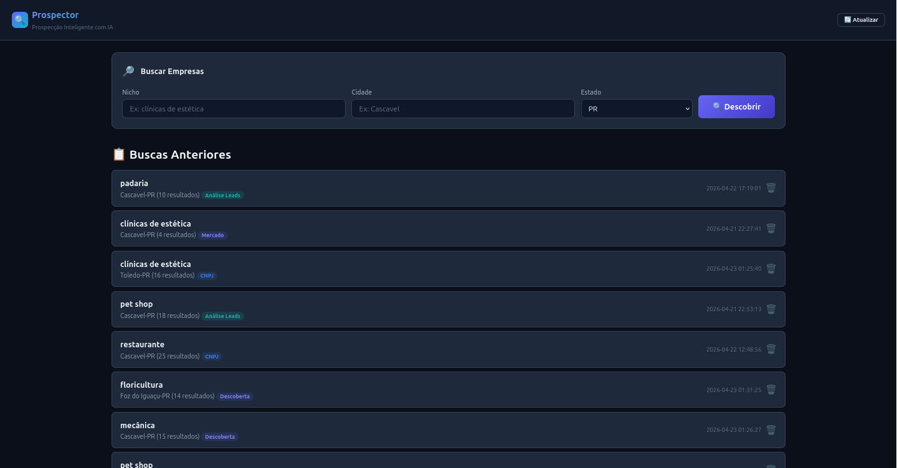
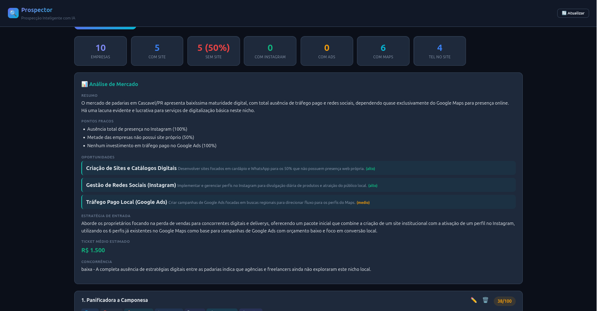
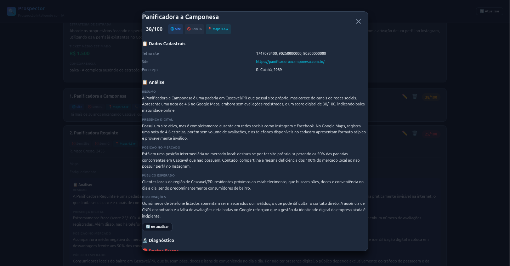
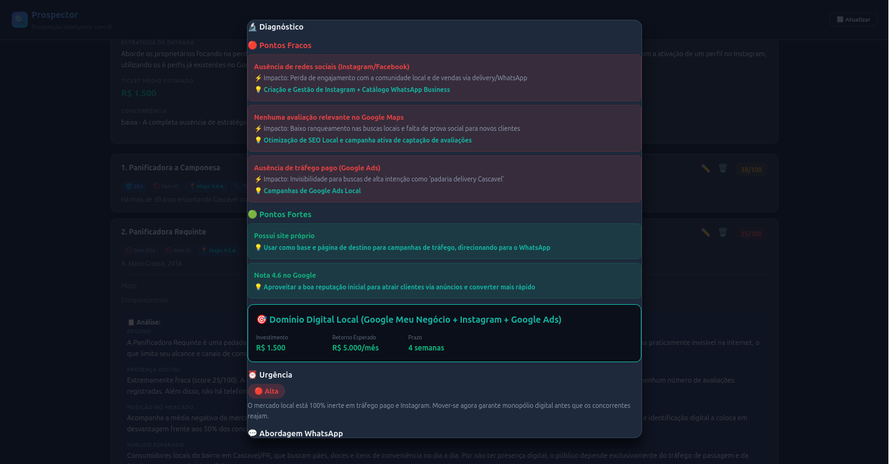
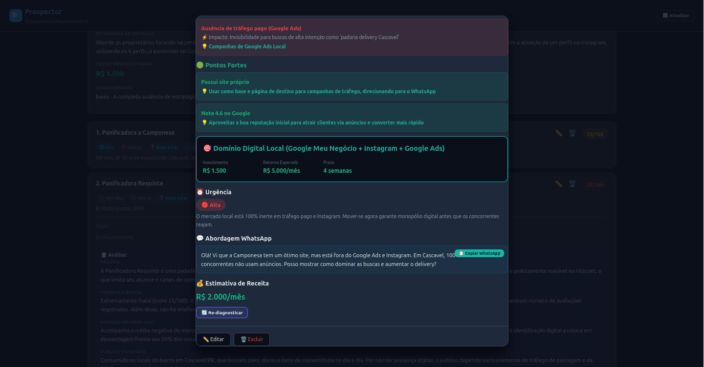

# 🔍 Prospector — Prospecção B2B com Inteligência Artificial

**Prospector** é uma ferramenta full-stack de geração e análise de leads B2B que combina scraping do Google, enriquecimento de dados empresariais, análise de mercado por IA e diagnóstico individual de leads — tudo em um único pipeline.

  

**🇺🇸 [Read in English](README.en.md)**

---

## ✨ Features

- **🔍 Discovery** — Busca empresas por nicho, cidade e estado via Google (Serper API)
- **📋 Enrichment** — Scraping de sites, Instagram, Google Maps e BrasilAPI (CNPJ) para cada lead
- **⭐ Scoring** — Score automático de 0-100 de presença digital por lead
- **📊 Market Analysis** — Insights macro de mercado gerados por IA (oportunidades, concorrência, estratégia)
- **🧠 Lead Analysis** — Diagnóstico individual por IA (fraquezas, forças, abordagem WhatsApp, estimativa de receita)
- **🔬 Full Diagnosis** — Diagnóstico profundo por lead com rating de urgência, serviços sugeridos e template de mensagem WhatsApp
- **📱 PWA** — Progressive Web App instalável com cache offline
- **⚡ Real-time Updates** — SSE streaming com fallback automático para polling
- **🎯 Filters & Sort** — Filtros por flags de presença, busca por nome, ordenação por score/nome
- **🛡️ XSS-safe** — Tagged template literal com escape automático contra XSS
- **🎨 Modular Frontend** — CSS/JS separados em módulos (state, API, components, app)

---

## 📸 Screenshots

### 🔍 Dashboard de Buscas

<p align="center">
  
</p>

Dashboard principal com histórico de buscas recentes e acesso rápido a pesquisas anteriores.

### 📋 Formulário de Pesquisa

<p align="center">
  
</p>

Busca por nicho (ex: restaurante, dentista) e cidade — o pipeline completa automaticamente.

### 📊 Resultados com Filtros

<p align="center">
  
</p>

Leads ranqueados por score de presença digital (0-100) com filtros por plataforma e ordenação.

### 🏢 Detalhe do Lead

<p align="center">
  
</p>

Dados enriquecidos: site, Instagram, Maps, CNPJ, score e presença digital detalhada.

### 🧠 Diagnóstico com IA

<p align="center">
  
</p>

Diagnóstico individual por IA: fraquezas, oportunidades, urgência e mensagem de abordagem para WhatsApp.

---

## 🎯 Público-Alvo

| Perfil | Uso |
|--------|-----|
| **Agências de marketing** | Prospecção de clientes B2B para oferecer serviços digitais |
| **Consultores de vendas** | Enriquecimento de leads e diagnóstico de abordagem |
| **SDRs / Pré-vendas** | Busca automática de empresas por nicho e localização |
| **Donos de negócio local** | Análise de concorrência e oportunidades no próprio mercado |
| **Startups B2B** | Validação de mercado e outbound automatizado |

## 💔 Problemas que Resolve

| Dor | Como Resolve |
|-----|-------------|
| **Encontrar leads qualificados** | Busca automática via Google, Maps e CNPJ |
| **Dados incompletos** | Enriquecimento com site, Instagram, telefone, email, CNPJ |
| **Sem priorização** | Score 0-100 de presença digital — foco nos que mais precisam |
| **Abordagem genérica** | Diagnóstico de IA com mensagem personalizada para WhatsApp |
| **Perda de tempo com leads ruins** | Filtros por plataforma, score e flags de presença |
| **Concorrência cega** | Análise de mercado com IA mostrando oportunidades e gaps |
| **Processo manual e lento** | Pipeline completa: busca → enriquece → pontua → analisa em minutos |
| **Sem diagnóstico individual** | Cada lead recebe análise de fraquezas, oportunidades e urgência |

---

## 🏗️ Arquitetura

```
┌─────────────────────────────────────────────────┐
│                   Frontend                       │
│   nginx:alpine — Arquivos estáticos + proxy     │
│   ├─ index.html (shell)                          │
│   ├─ css/styles.css (design system)              │
│   ├─ js/state.js (estado reativo)                │
│   ├─ js/api.js (fetch + cliente SSE)              │
│   ├─ js/components.js (renderização XSS-safe)     │
│   ├─ js/app.js (orquestrador)                    │
│   ├─ manifest.json + sw.js (PWA)                 │
│   └─ icons/ (192px + 512px)                      │
├─────────────────────────────────────────────────┤
│                   Backend                         │
│   Python 3.11 + Flask + Gunicorn                 │
│   ├─ /api/search (CRUD + pipeline)               │
│   ├─ /api/search/<id>/stream (SSE)               │
│   ├─ /api/history                                │
│   ├─ /api/search/<id>/lead/<id> (CRUD)           │
│   └─ /api/health (status do circuit breaker)    │
├─────────────────────────────────────────────────┤
│              Serviços Externos                    │
│   ├─ Serper API (Google Search)                  │
│   ├─ BrasilAPI (CNPJ lookup)                     │
│   ├─ Google Maps (info de negócios)              │
│   └─ Ollama Cloud (GLM-5.1 / MiniMax)           │
└─────────────────────────────────────────────────┘
```

### Fluxo do Pipeline

```
Discovery → Enrich → Score → Analyze Market → Analyze Leads → Diagnose
```

Cada etapa pode ser re-executada independentemente. O frontend suporta rodar o pipeline completo ou etapas individuais.

---

## 🚀 Quick Start

### Docker Compose (Recomendado)

```bash
# Clone o repositório
git clone https://github.com/paulogirto-hub/prospector.git
cd prospector

# Configure suas API keys
cp .env.example .env
# Edite .env com suas SERPER_KEY e OLLAMA_KEY

# Suba tudo
docker compose up -d --build

# Acesse em http://localhost:8088
```

### Setup Manual

<details>
<summary>Backend (Python)</summary>

```bash
cd backend
python -m venv venv
source venv/bin/activate
pip install -r requirements.txt

# Configure as variáveis de ambiente
export SERPER_KEY=sua_serper_api_key
export OLLAMA_KEY=sua_ollama_api_key
export OLLAMA_BASE=https://ollama.com/v1
export OLLAMA_MODEL=glm-5.1
export DATA_DIR=./data

# Rode
gunicorn app.main:app --bind 0.0.0.0:5000 --workers 4 --timeout 300
```

</details>

<details>
<summary>Frontend (nginx)</summary>

```bash
# Copie os arquivos do frontend para o diretório do nginx
# Ou sirva com qualquer servidor estático que faça proxy de /api/ para o backend
```

</details>

---

## ⚙️ Variáveis de Ambiente

| Variável | Obrigatória | Default | Descrição |
|----------|-------------|---------|-----------|
| `SERPER_KEY` | ✅ | — | Serper API key (Google Search) |
| `OLLAMA_KEY` | ✅ | — | Ollama Cloud API key (IA) |
| `OLLAMA_BASE` | ❌ | `https://ollama.com/v1` | URL base da API Ollama |
| `OLLAMA_MODEL` | ❌ | `glm-5.1` | Modelo de IA para análise/diagnóstico |
| `DATA_DIR` | ❌ | `./data` | Diretório para dados persistentes |

---

## 📡 Documentação da API

Referência completa da API disponível em:

| Arquivo | Idioma |
|---------|--------|
| [`docs/API.md`](docs/API.md) | 🇧🇷 Português |
| [`docs/API.en.md`](docs/API.en.md) | 🇺🇸 English |

### Principais Endpoints

| Método | Endpoint | Descrição |
|--------|----------|-----------|
| `POST` | `/api/search` | Criar nova busca (inicia discovery) |
| `GET` | `/api/search/{id}` | Obter dados da busca + leads |
| `GET` | `/api/search/{id}/stream` | SSE stream para atualizações em tempo real |
| `DELETE` | `/api/search/{id}` | Deletar busca |
| `POST` | `/api/search/{id}/enrich` | Enriquecer leads (CNPJ, site, Instagram) |
| `POST` | `/api/search/{id}/score` | Calcular scores |
| `POST` | `/api/search/{id}/analyze-market` | Análise de mercado por IA |
| `POST` | `/api/search/{id}/analyze-leads` | Análise individual de leads por IA |
| `POST` | `/api/search/{id}/analyze` | Rodar pipeline completa |
| `GET` | `/api/history` | Listar todas as buscas |
| `PUT` | `/api/search/{id}/lead/{lid}` | Atualizar campos do lead |
| `DELETE` | `/api/search/{id}/lead/{lid}` | Deletar um lead |
| `POST` | `/api/search/{id}/diagnose/{lid}` | Gerar diagnóstico por IA |

---

## 🧪 Desenvolvimento

### Arquitetura do Frontend

O frontend usa arquitetura modular com ES modules:

```
frontend/
├── index.html          # HTML shell (sem CSS/JS inline)
├── css/styles.css      # Design system + todos os estilos (~31KB)
├── js/
│   ├── state.js        # Gerenciamento de estado reativo com Proxy
│   ├── api.js          # Fetch wrapper + cliente SSE com fallback para polling
│   ├── components.js   # Renderização XSS-safe (html`` tagged template)
│   └── app.js          # Orquestrador principal + event handlers
├── manifest.json       # Manifest PWA
├── sw.js               # Service worker (cache-first para estáticos, network para API)
└── icons/              # Ícones PWA (192px, 512px)
```

### Decisões de Design Chave

1. **Segurança XSS** — `html` tagged template escapa automaticamente interpolações `${}`. Use `rawHtml()` apenas para conteúdo confiável.
2. **SSE + Polling** — `connectSSE()` tenta EventSource primeiro, com fallback para polling de 3s. O endpoint `/stream` é opcional — o app funciona só com polling.
3. **Estado Reativo** — `AppState` usa JavaScript Proxy para notificar subscribers em mudanças. Componentes re-renderizam em atualizações de estado.
4. **Skeleton Screens** — Funções `showSkeleton*()` exibem UI placeholder durante carregamento.
5. **Tratamento de Erros** — `safeFetch()` envolve todas as chamadas de API com retry. `renderErrorCard()` mostra mensagens de erro acionáveis.

### Arquitetura do Backend

```
backend/
├── app/
│   ├── main.py           # Flask app factory + error handlers
│   ├── config/settings.py  # Configuração + env vars
│   ├── middleware/
│   │   └── rate_limit.py # Sliding window rate limiter
│   ├── models/
│   │   └── errors.py      # Error classes + response helpers
│   ├── routes/
│   │   └── search.py      # Todos os endpoints da API + SSE
│   └── services/
│       ├── persistence.py # Armazenamento em JSON
│       ├── pipeline.py    # Orquestração do pipeline
│       ├── external_api.py # Serper, BrasilAPI, Maps
│       └── scraper.py     # Scraping de sites
├── requirements.txt
└── Dockerfile
```

---

## 🏛️ Meta-Framework

O Prospector inclui um **Meta-Framework de Engenharia de Sistemas** com 74 módulos cobrindo todo o ciclo de vida do produto.

### Estado Atual da Implementação

| Camada | Módulos | Implementado | Status |
|--------|---------|-------------|--------|
| **Core** (regras, dados, arquitetura) | 8 | 3 | 🟡 Parcial |
| **Backend** (API, segurança, testes) | 8 | 4 | 🟡 Parcial |
| **Frontend** (design, upload, UX) | 8 | 3 | 🟡 Parcial |
| **AI** (providers, streaming, RAG) | 6 | 2 | 🔴 Básico |
| **Infra** (deploy, CI/CD, SLO) | 7 | 2 | 🔴 Básico |
| **Business** (pagamentos, growth) | 12 | 0 | ⚪ Planejado |
| **Ops** (observabilidade, FinOps) | 6 | 1 | 🔴 Básico |
| **Advanced** (feature flags, DLQ) | 5 | 0 | ⚪ Planejado |
| **Shared** (segurança, glossário) | 13 | 0 | ⚪ Planejado |

> **Resumo:** O MVP cobre o Happy Path (discovery → enrich → score → analyze → diagnose). O meta-framework define o roadmap enterprise — autenticação, multi-tenant, pagamentos, observabilidade, auto-cura e compliance estão planejados mas **não implementados**.

### Validação

```bash
python3 scripts/validate-framework.py --path docs/meta-framework -v
```

### Documentação

| Arquivo | Idioma |
|---------|--------|
| [`docs/API.md`](docs/API.md) | 🇧🇷 Português |
| [`docs/API.en.md`](docs/API.en.md) | 🇺🇸 English |
| [`docs/meta-framework/README.md`](docs/meta-framework/README.md) | 🇧🇷 Português |
| [`docs/meta-framework/README.en.md`](docs/meta-framework/README.en.md) | 🇺🇸 English |
| [`docs/meta-framework/MASTER.md`](docs/meta-framework/MASTER.md) | 🇧🇷 Português |
| [`docs/meta-framework/MASTER.en.md`](docs/meta-framework/MASTER.en.md) | 🇺🇸 English |

---

## 🤝 Contribuindo

1. Faça fork do repositório
2. Crie uma branch: `git checkout -b feature/minha-feature`
3. Commit suas mudanças: `git commit -m 'Add minha feature'`
4. Push na branch: `git push origin feature/minha-feature`
5. Abra um Pull Request

### Guidelines

- **Frontend**: Mantenha CSS/JS modular — sem estilos ou scripts inline no HTML
- **Backend**: Siga padrões Flask Blueprint, use type hints, adicione docstrings
- **API**: Mantenha compatibilidade com versões anteriores, documente mudanças em `docs/API.md`
- **Commits**: Use conventional commits (`feat:`, `fix:`, `docs:`, `refactor:`)

---

## 📄 Licença

Licença MIT — veja [LICENSE](LICENSE) para detalhes.

---

## 🙏 Créditos

- **Serper API** — Resultados do Google Search
- **BrasilAPI** — Dados de CNPJ brasileiro
- **Ollama Cloud** — Análise e diagnóstico por IA (GLM-5.1, MiniMax-M2.7)
- **Flask** — Framework web Python
- **nginx** — Servidor estático e proxy reverso

---

<div align="center">

**[Prospector](https://github.com/paulogirto-hub/prospector)** — Feito com 🔍 e 🧠

</div>